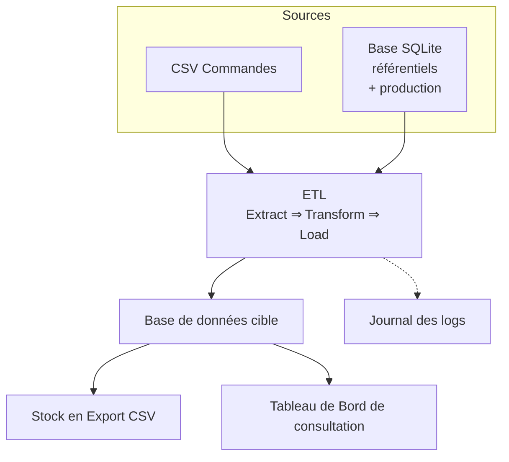

# Distributech

## 📑 Sommaire
- [📖 Présentation](#-présentation)
- [📂 Sources de données](#-sources-de-données)
- [🛠️ Pipeline ETL](#️-pipeline-etl)
- [🗄️ Base relationnelle](#️-base-relationnelle)
- [📊 Tabeau de Bord](#-tableau-de-bord)
- [🏗️ Architecture du projet](#-architecture-du-projet)
- [🚀 Installation](#-installation)
- [📂 Arborescence du projet](#-arborescence-du-projet)
- [▶️ Utilisation](#️-utilisation)
- [📑 Documentations](#-documentations)
- [📌 Auteur](#-auteur)

## 📖 Présentation
Projet pédagogique consistant à mettre en place un processus **ETL en Python** pour centraliser les données de commandes et de stocks de l’entreprise fictive *Distributech*, grossiste en équipements électroniques.

## 📂 Sources de données
- **Fichiers CSV hebdomadaires** : commandes envoyées par les revendeurs.
- Exemple fichier `commandes_revendeur.csv` :
  ```csv
  numero_commande,commande_date,revendeur_id,region_id,product_id,quantity,unit_price
  CMD-20250710-001,2025-07-10,1,1,101,5,59.9
  CMD-20250710-001,2025-07-10,1,1,102,10,19.9
- **Base SQLite locale** : référentiels (produits, régions, revendeurs) et mouvements de production(production).  

## 🛠️ Pipeline ETL
- **Extract** : lecture des fichiers CSV et de la base SQLite.  
- **Transform** : nettoyage, normalisation, suppression des doublons, gestion des incohérences.  
- **Load** : intégration dans la base relationnelle MySQL.  

Un export CSV de l’état du stock est produit en fin de cycle.

## 🗄️ Base relationnelle
La base MySQL cible est organisée autour des tables :  
`regions`, `revendeurs`, `produits`, `commandes`, `lignes_cmd`, `production`.  

Trois vues principales facilitent l’analyse :  
- `v_stock` → état courant du stock  
- `v_cmds_par_region` → commandes par région  
- `v_chiffre_affaires_par_region` → chiffre d’affaires consolidé  

## 📊 Tableau de bord
Il permet d’interroger directement la base, de consulter les indicateurs :
- Suivi des stocks globaux et par produit
- Historique des commandes  
- Chiffre d’affaires par région  
- Export CSV possible des résultats

## 🏗️ Architecture du projet
Le schéma ci-dessous illustre l’organisation générale du pipeline ETL et des flux de données :


## 💻 Technologies utilisées

- **Langage** : Python 3.x  
- **Bibliothèques principales** :  
  - pandas → traitement et transformation des données  
  - mysql.connector → connexion et requêtes MySQL  
  - sqlite3 → lecture de la base SQLite locale  
- **Base relationnelle cible** : MySQL  
- **Compatibilité OS** : Windows et Linux  
- **Exécution** : mode batch (pipeline complet sans interaction utilisateur)  

## 🚀 Installation
**1. Cloner le projet et préparer l’environnement Python**
```bash
git clone https://github.com/natbediee/distributech.git
cd distributech
python3 -m venv .dtvenv
source .dtvenv/bin/activate
pip install -r requirements.txt
```
**2. Configurer les variables d’environnement**

Copier le modèle .env.template et compléter vos informations :
```bash
cp .env.template .env
```
**3. Lancer l’infrastructure MySQL (Docker)**
```bash
docker compose -f bdd/docker-compose.yml up -d
```

MySQL : localhost:3306

Adminer : http://localhost:8080

**4. Créer la base SQLite locale**
```bash
python3 scripts/db_stock.py
```

Cette base contient les référentiels (produits, régions, revendeurs) et les mouvements de production(produciton).

## 📂 Arborescence du projet
```
.
├── scripts/               
│   ├── main_etl.py        # Pilotage global du processus ETL
│   ├── db_sql.py          # Création de la base MySQL (si absente)
│   ├── db_stock.py        # Création de la base SQLite locale
│   ├── extract.py         # Extraction des données depuis CSV et SQLite
│   ├── transform.py       # Nettoyage et validation des données
│   ├── load.py            # Chargement dans la base centrale
│   ├── post_etl.py        # Génération de l’état des stocks après ETL
│   ├── query_menu.py      # Tableau de bord SQL en ligne de commande
│   └── commun.py          # Fonctions partagées (logs, vérifications…)
│
├── data/                  
│   ├── in/                # Fichiers CSV d’entrée
│   ├── log/               # Logs ETL
│   ├── stock/             # Exports de stock générés
│   └── treated/           # Fichiers CSV traités
│
├── docs/                  
│   ├── CDC_Distributech_nbediee.pdf
│   ├── DT_Distributech_nbediee.pdf
│   └── Distributech_Gantt_nbediee.pdf
│
├── bdd/
│   └── docker-compose.yml # Services MySQL + Adminer
│
├── requirements.txt       
├── README.md              
├── .gitignore             
├── .env.example           
└── .env                   # Variables locales (non versionné)
```
## ▶️ Utilisation

Lancer l’ETL complet :
```bash
python3 scripts/main_etl.py
```

Consulter les résultats dans  :

Exports CSV générés dans data/stock/

Pour lancer le Tableau de bord interactif :
```bash
python3 scripts/query_menu.py
```

## 📑 Documentations

- Cahier des charges

- Dossier technique

- Planning Gantt

## 📌 Auteur

Projet réalisé par **Nathalie Bediee** dans le cadre de la formation **Développeur IA – ISEN Brest**.

🔗 [Mon profil LinkedIn](https://www.linkedin.com/in/nathalie-b%C3%A9di%C3%A9e-548652295/)
